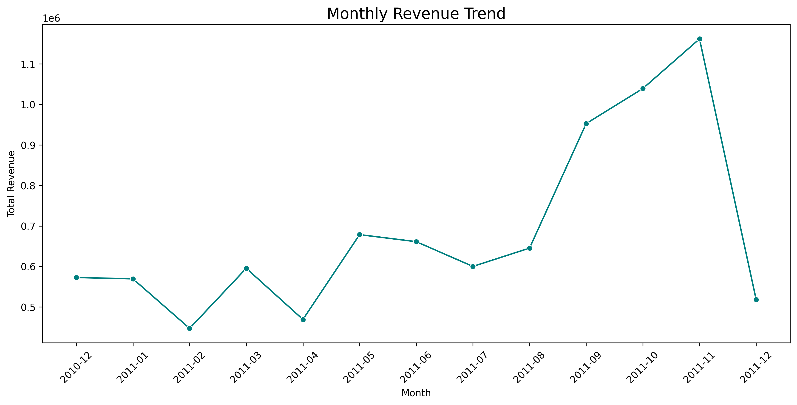
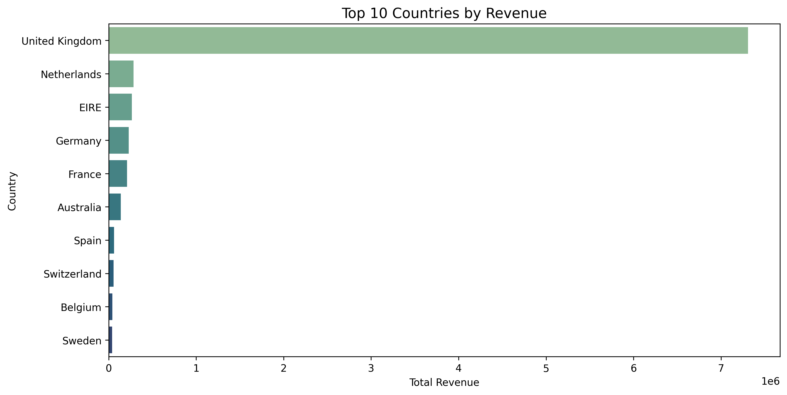
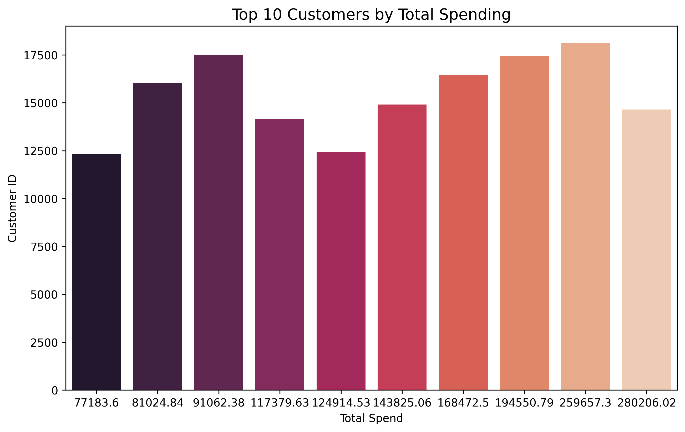
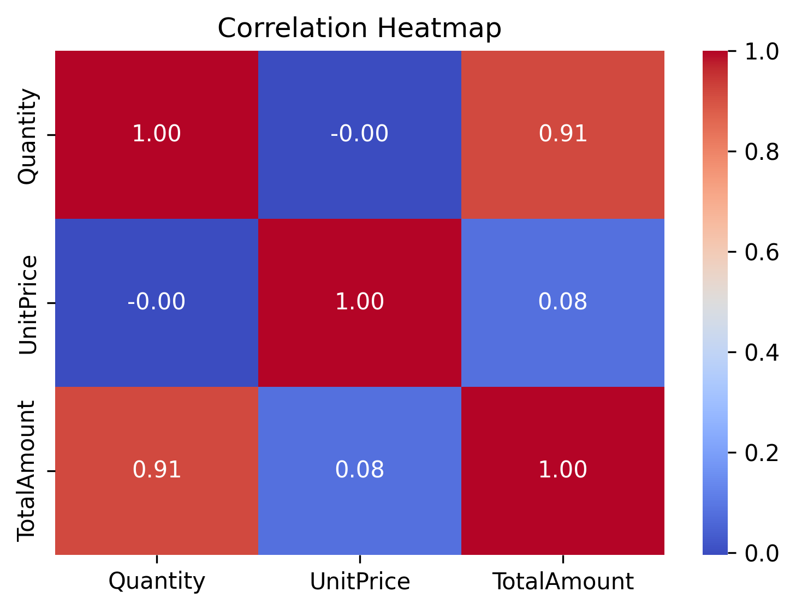

# ecommerce-sales-analysis
Exploratory Data Analysis on UK Retail E-commerce dataset using Python
# 📦 E-commerce Sales Analysis (EDA Project)

This project showcases an exploratory data analysis (EDA) of a UK-based online retail dataset. The dataset contains transactional data for an e-commerce store from 2010–2011, and the analysis was performed using Python libraries like Pandas, Matplotlib, and Seaborn.

---

## 📊 Objective

To uncover key business insights by analyzing:
- Revenue trends over time
- Top-performing products and customers
- Country-wise sales performance
- Correlations between variables

---

## 📁 Dataset Overview

- **Source**: UCI Machine Learning Repository  
- **Rows**: 541,909  
- **Columns**: 8  
- **Fields**:
  - `InvoiceNo`, `StockCode`, `Description`, `Quantity`
  - `InvoiceDate`, `UnitPrice`, `CustomerID`, `Country`

---

## 🔍 Key Insights

### 🗓️ Monthly Revenue Trend

- Revenue shows seasonal spikes, peaking in **November 2011**  
- Indicates the impact of holiday shopping seasons

---

### 🌍 Top 10 Countries by Revenue

- **United Kingdom** dominates sales
- Other top contributors: Netherlands, Germany, France, Australia

---

### 👥 Top 10 Customers by Spend

- Highlights most valuable customers by `CustomerID`
- Useful for loyalty programs and retention strategies

---

### 📈 Correlation Heatmap

- Strong positive correlation between **Quantity** and **TotalAmount**
- Other features show low/no correlation

---

## 🧰 Tools Used

- Python (Jupyter/Colab)
- Pandas
- Matplotlib
- Seaborn

---

## 🧠 Learnings

- Handling missing values & cleaning large datasets  
- Feature creation (`TotalAmount`, `YearMonth`)  
- Aggregating & grouping insights using `groupby()`  
- Building clear and insightful visualizations  
- Interpreting business-level insights from raw data

---

## 📂 Project Files

- `EDA_Ecommerce_Project.ipynb` → Main notebook  
- `.png` files → All visualizations generated and saved from the notebook

---

## 🚀 Author

**Aishwarya M Patil**  
B.Tech AIML | Data Enthusiast | Sanjay Ghodawat University  
🔗 [LinkedIn](https://www.linkedin.com/in/aishwarya-patil-27529225b) | ✉️ aishwaryapatil845@gmail.com

---

> ⭐ If you found this project helpful, feel free to star the repo!
